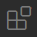
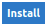

# Urban Computing Assignment 1
This repository contains the first assignment for the Urban Computing course in fall 2021. The excersises can be found in *"Assignment1_Exercises.ipynb"*, to hand in your work you need to push it to GitHub classroom. You can do this via the build-in Git interface of VS Code, or by executing the following commands:
```bash
git add .
git commit -m "Commit message here"
git push
```
Please check afterwards if the latest version of the code is actually pushed to the GitHub classroom.


We will be working in *development containers* that are completely isolated from your system's OS and software. One of the benefits of this approach is that you won't have to install any languages and dependencies on your machine and that everyone uses the exact same environment. This will benefit reproducibility and allows us to work cross-platform effortlessly.


## Installation
We will be using Visual Studio Code (VS Code) as IDE. The container development functionality of VS Code provides us better reproducibility and will help tremendously in running the code on different machines without effort.

Steps to create our working environment:
- Make sure you have [Docker](https://docs.docker.com/get-docker/) installed on your system.
    - If you are running Linux, make sure to follow the additional post-installation step [Manage Docker as a non-root user](https://docs.docker.com/engine/install/linux-postinstall/#manage-docker-as-a-non-root-user).
- Make sure you have [VS Code](https://code.visualstudio.com/) installed on your system.
- Clone and open this repository in VS Code.
- Click on the extensions icon in the toolbar: .
- Search for the *"Remote Development"* extension and press the install button .
- (Optional) Search for the *"Docker"* extension and install this extension. It allows you to manage containers from within VS Code.
- You should now be able to see the *"Open a Remote Window"*  button in the bottom left corner.
- Click this button and select *"Reopen in Container"*.
- The container will now be build, which might take a while for the first time.
- After the container is built, VS Code will be running within the container.
    - You can check if VS Code is running within the container in the bottom left corner. It should say *"Dev Container: Python 3"*.
- Reload VS Code to activate linters and formatters: Ctrl/Cmd+Shift+P -> Developer: Reload Window. Alternatively, you can just close and reopen VS Code.

Your can now open the notebook *"Lab1_Exercises.ipynb"* and start working on your assignment.

## Submission procedure
The repository must be pushed to the GitHub classroom before **October 5th, at 23:55**. The code must run without issues after we create the development container. This means that any pip packages that are required to run your notebook must be included in the *"requirements.txt"* file.

Follow these steps to make sure all pip dependencies are correctly included:
- Make sure VS Code is running within the development container (see next to last step at *"Installation"*).
- Open the VS Code integrated terminal (Ctrl+`).
- Execute: `pip freeze > requirements.txt`.
    - `pip freeze` will print all currently installed pip packages with their version number pinned. `> requirements.txt` will redirect the output to a file (in this case *"requirements.txt"*).

To test if all dependencies are included:
- Click on  in the lower left corner and select *"Rebuild Container"*.
- Wait until the rebuild has finished.
- Your notebook should now be able to run front to end without problems (if not -> FIX!).

You can now push the final version of your assignment to the GitHub classroom.

## Tips & Tricks
- You can install additional Python packages while within the Python container through: `pip install <your package>`.
- A light VS Code theme might be preferred while working with Python notebooks
    - To change themes: File/Code -> Preferences -> Color Theme
- (advanced) If you need to install non-Python packages, uncomment the last line in the *".devcontainer/Dockerfile"* file and add the packages in the placeholder. Rebuild your container to install the packages.

# References
## Development Containers
- [Beginner's Series to Dev Containers](https://www.youtube.com/watch?v=61M2takIKl8&list=PLj6YeMhvp2S5G_X6ZyMc8gfXPMFPg3O31) on Youtube

## Numpy & Pandas
- [Cloud X Lab - introduction to Numpy and Pandas](https://cloudxlab.com/blog/numpy-pandas-introduction/)
- [Zero With Dot - Performance of numpy and pandas - comparison](https://zerowithdot.com/python-numpy-and-pandas-performance/)
- [Sofia Heisler - A Beginner’s Guide to Optimizing Pandas Code for Speed](https://engineering.upside.com/a-beginners-guide-to-optimizing-pandas-code-for-speed-c09ef2c6a4d6) basic optimization techniques, see also her PyCon 2017 talk on [YouTube](https://www.youtube.com/watch?v=HN5d490_KKk).
- [Pandas - Enhancing Performance](https://pandas.pydata.org/pandas-docs/stable/user_guide/enhancingperf.html) deeper enhancement techniques
- [Numexpr](https://github.com/pydata/numexpr) easily speed up more complex numpy operations
- [Real Python - Look Ma, No For-Loops: Array Programming With NumPy](https://realpython.com/numpy-array-programming/) a somewhat easier introduction to vectorization
- [Python Like You Mean It - Vectorized Operations](https://www.pythonlikeyoumeanit.com/Module3_IntroducingNumpy/VectorizedOperations.html) a bit more advanced text about vectorization

## Matplotlib
- [Real Python - Python Plotting With Matplotlib (Guide)](https://realpython.com/python-matplotlib-guide/)
- [Practical Business Python - Effectively Using Matplotlib](https://pbpython.com/effective-matplotlib.html)
